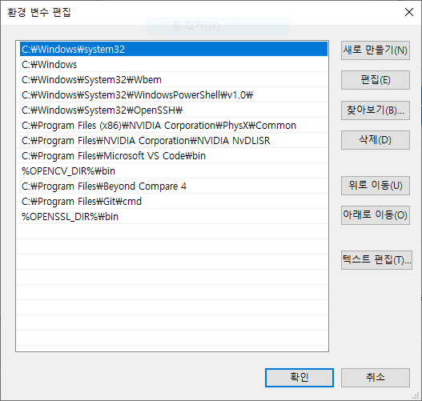
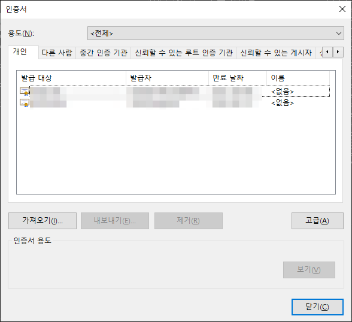
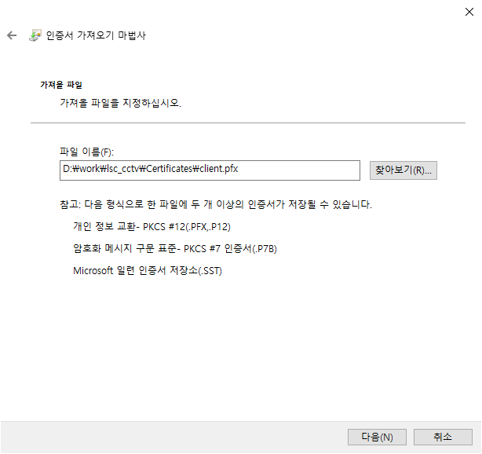
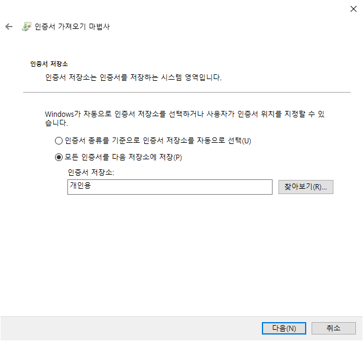
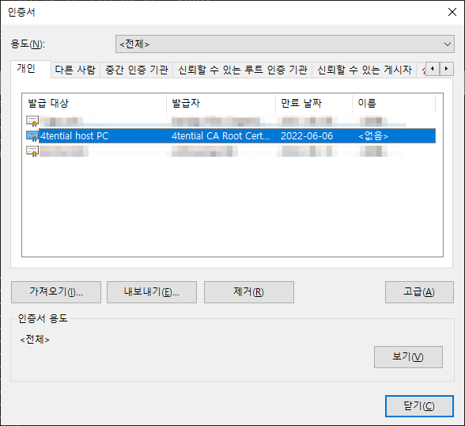
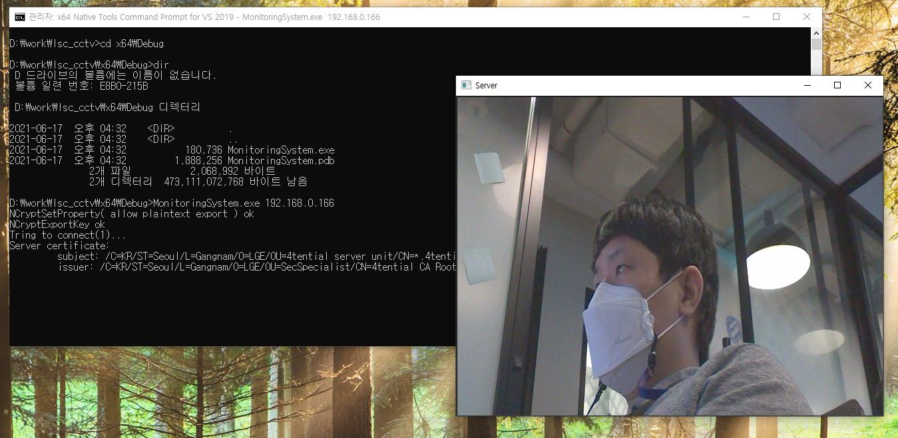

# Build and Install Guide
For CCTV Monitoring System in Windows.

## Install library and setup

#### 1. Download and install libaries
- [OpenCV v4.5.1](https://sourceforge.net/projects/opencvlibrary/files/4.5.1/opencv-4.5.1-vc14_vc15.exe/download)
- [Win64 OpenSSL v1.1.1k](https://slproweb.com/products/Win32OpenSSL.html)

#### 2. Setting environment variables
1. Search and select System (Control Panel)
2. Click on the Advanced system settings link and then click Environment Variables. Under the section System Variables, click New.
3. Add 2 System Variable `OPENCV_DIR`, `OPENSSL_DIR` as below (The path can be different for installed location)<br>
4. Under the section System Variables, select `Path` and click Edit add Add `%OPENCV_DIR%\bin` and `%OPENSSL_DIR%\bin`<br>


## Build
### Build in command line
1. Run `x64 Native Tools Command Prompt for VS 2019` by selecting in windows menu.
2. Go to project directory
3. Run command (directory path may different for code location)
```
D:\work\lsc_cctv>msbuild MonitoringSystem.sln
```

### Build using Visual Studio
1. Open solution by choosing `MonitoringSystem.sln`
2. Build the solution.

## Register key pair for client.
Client key is needed for secure connection with CCTV.

1. Run `x64 Native Tools Command Prompt for VS 2019` by selecting in windows menu.
2. Run command `certmgr.exe`<br>
3. Select `Import` and choose the client certificate `./Certificate/client.pfx`. (Note the file type is `*.pfx`) then choose `Next`<br>
4. Leave blank in password and ensure the 2nd option - enable to export is checked. Then choose `Next` <br>
5. Confirm the certificate is saved for personal then choose `Next`<br>
6. Ensure the certificate `4tential host PC` is added in the list successfully.<br>
   

## Run
1. Go to the directory which the excutable is located. (ex, `D:\work\lsc_cctv\x64\Debug`)
2. Execute with target IP address. Target address can be different for the circumstances.
```
D:\work\lsc_cctv\x64\Debug>MonitoringSystem.exe 192.168.0.166
```

